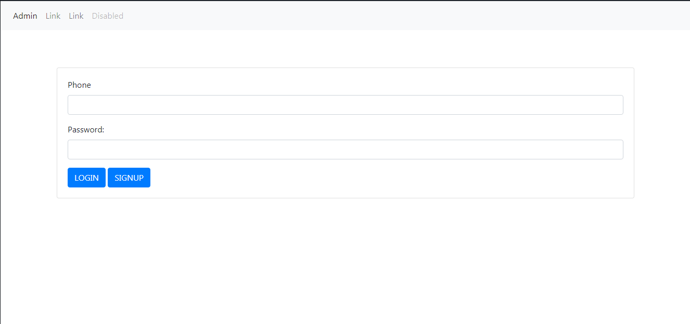
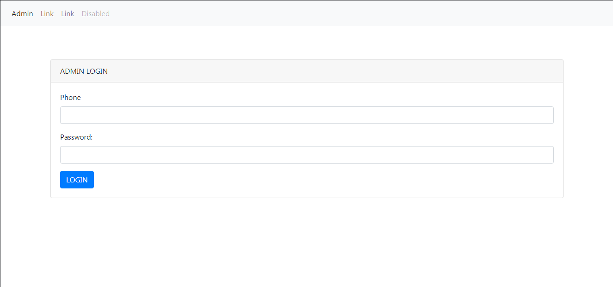

# 📧 InternalO
Open Php framework for Internal office use. It helps you track a small team with roster upload and in-mail system.

# How?
Non-admins log in and sign up via their phone number. Admins decide whether or not to approve.

# Setup

Environment

Xamp, see [here](https://www.apachefriends.org/download.html)

SQL

```
Table: users
id - Auto Increment (AI on phpmyadmin)
telnum - varchar 200
pswd - varchar 255
admin - varchar 200
confirmed - varchar 200

Table: messages
id - Auto Increment (AI on phpmyadmin)
sender - varchar 200
receiver - varchar 200
title - varchar 200
text - varchar 200
viewed - varchar 200
date - varchar 200
time - varchar 200
```

# Main Files

- specify connection settings in ```settings.ini.php```
- index.php: main page
- roster.php: user profile page
- admin_login.php
- admin_dashboard.php

# Demo

- Login


#
- Roster


#
- Admin Login


#
- Admin Dashboard - Adding & Confirming


#
- Admin Dashboard - Send In-Mail


#
- Admin Dashboard - View mails


#
