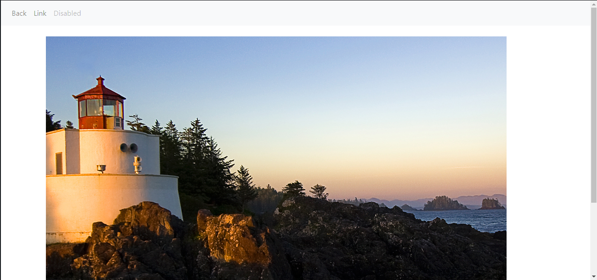
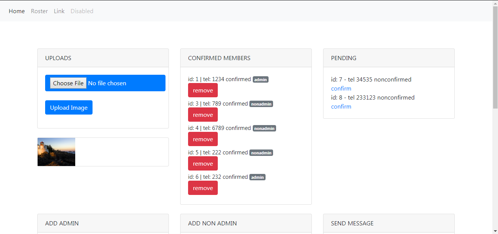
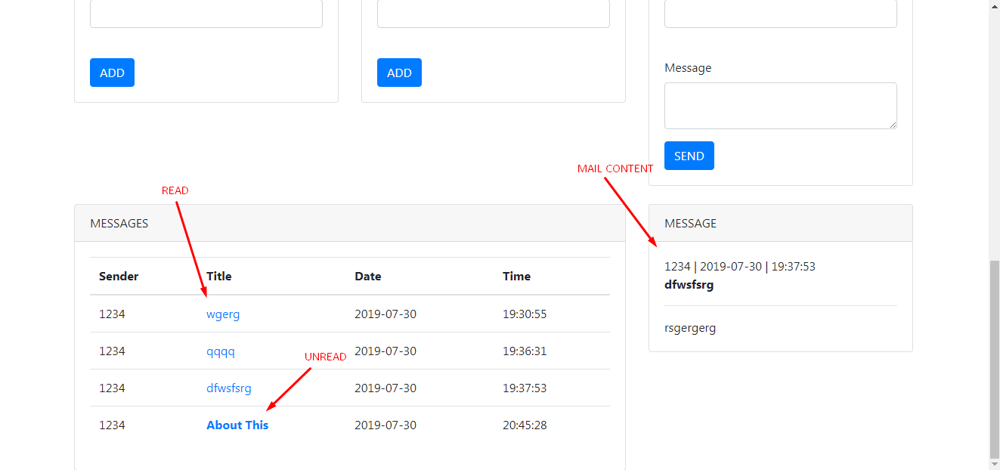

# 📧 InternalO
Open Php framework for Internal office use. It helps you track a small team with roster upload and in-mail system.

# How?
Non-admins log in and sign up via their phone number. Admins decide whether or not to approve.

# Demo

- Login

#
- Roster

#
- Admin Login

#
- Admin Dashboard - Adding & Confirming

#
- Admin Dashboard - Send In-Mail

#
- Admin Dashboard - View mails

#
